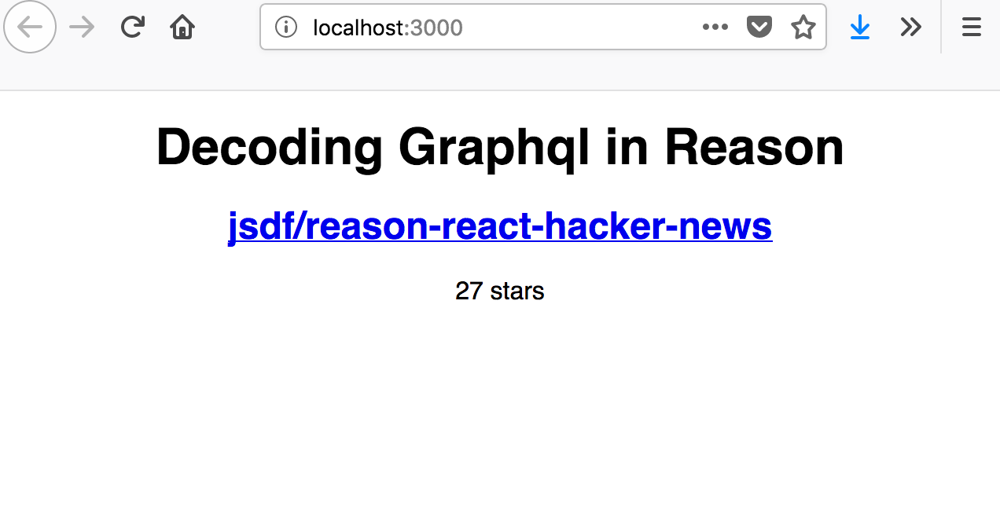

# Decoding API Response JSON in ReasonReact

Reason is a new statically-typed functional programming language from Facebook which can be compiled to Javascript. Reason React is a wrapper for React which makes it easy to use from Reason.

We're going to build a small single page web app to put Reason React through its paces. The app will display a list of top Reason-related Github repos. It's a small enough task that we can complete it in a few hours, but also has enough complexity that we can kick the tires of this new language. This tutorial expects no existing knowledge of Reason, though a basic familiarity with static types would be helpful.

# A New Project

We're going to use `create-react-app` using `reason-scripts` which will create a starting point for our app, which is going to be called `decoding-json`:

```
yarn create react-app decoding-reason -- --scripts-version reason-scripts
```

Start the project by running `yarn start` which should open `https://localhost:3000` in your browser.

# A Record Type

We will be decoding a response from the public data from this Github API request: https://api.github.com/search/repositories?q=topic%3Areasonml&type=Repositories but first lets set it up using fake data.

Create a new file called RepoData.re and add this code into it.

```
type repo = {
  full_name: string,
  stargazers_count: int,
  html_url: string
};
```

# Files are modules

We've defined our type at the top level of the file.

> Top-level basically means visually, no indentation (very poor way of explaining it, but you get the idea). a let foo = 1 that’s not nested inside anything else is top-level. a let foo = 1 that’s inside a function body isn’t at the top-level. [@chenglou](https://reasonml.chat/t/bucklescript-top-level-declarations/399/3?u=idkjs)

In Reason, every file is a module, and all the things defined at the top level of the file using the keywords let, type, and module are exposed to be used from other files (that is, other modules). In this case, other modules can reference our repo type as RepoData.repo. Unlike in Javascript, no imports are required to reference things from other modules.

Let's use our type in app.re. The repos page is just a list of repos, with each item in the list consisting of the name of the repo (linking to the repo on Github), and the number of stars the repo has. We'll define some dummy data and sketch out a new component called `RepoItem` in `RepoItem.re` to represent an item in the list of repos:

```
//RepoItem.re
let component = ReasonReact.statelessComponent("RepoItem");

let make = (_children) => {
  ...component,
  render: (_self) => {
    /* our dummy data */
    let dummyRepo: RepoData.repo = {
      stargazers_count: 27,
      full_name: "jsdf/reason-react-hacker-news",
      html_url: "https://github.com/jsdf/reason-react-hacker-news"
    };

    <div className="App">
      <h1>{ReasonReact.stringToElement("Reason Projects")}</h1>
      <RepoItem repo=dummyRepo />
    </div>
  }
};
```

In the statement beginning `let dummyRepo: RepoData.repo = {...}`, `dummyRepo` is the name of the constant we're defining and `RepoData.repo` is the type we're annotating it with which is coming from where we defined it in `RepoData.re`. Remember that this module is available anywhere in the project. Reason can infer the types of most things we declare, but here it's useful to include the annotation so that the typechecker can let us know if we've made a mistake in our test data.

# Return values in Reason

Note that the body of the render function is now wrapped in {} braces, because it contains multiple statements. In Javascript, if we used braces around the body of an => arrow function we'd need to add a return statement to return a value. However in Reason, the value resulting from the last statement in the function, here:

```jsx
...
<div className="App">
      <h1>{ReasonReact.stringToElement("Reason Projects")}</h1>
      <RepoItem repo=dummyRepo />
</div>
```

automatically becomes the return value. If you don't want to return anything from a function, you can make the last statement `()` (which is called 'unit' in [Reason](https://reasonml.github.io/docs/en/function.html#optional-labeled-arguments)).

# Defining Components in Reason React

You might now see an error saying The module or file `RepoItem`can't be found. That's because we added `<RepoItem repo=dummyRepo />` in the render function of the `App component`, but we haven't created that module yet. Add a new file called `RepoItem.re` containing:

```
let component = ReasonReact.statelessComponent("RepoItem");

let make = (~repo: RepoData.repo, _children) =>
  {
    ...component,
    render: (_self) =>
      <div>{ReasonReact.string(repo.full_name)}</div>
  };
```

What's going on here? Let's dissect what's happening in this file.

Each Reason React component is a Reason module which defines a function called make, which defines props and children arguments. The props are specified as [Labeled Arguments](https://reasonml.github.io/docs/en/function.html#labeled-arguments).

```
let component = ReasonReact.statelessComponent("SomeComponent");

let make = (~someProp, ~anotherProp, _children) => /* some stuff here */;
```

This `make` function returns a record. The first thing in this record is typically `...component`, where `component` is the return value of `ReasonReact.reducerComponent` or `ReasonReact.statelessComponent` (for components which do and don't use state, respectively). If this seems a bit weird, just think of it as inheriting from the React component class, like the equivalent of doing `class Foo extends React.Component {...` in ReactJS.

```
//RepoItem.re
let component = ReasonReact.statelessComponent("RepoItem");

let make = (~someProp, ~anotherProp, _children) =>
  {
    ...component,
    /* render and lifecycle methods go here */
  };
```

The rest of the record is where you can add the `render` function and the [lifecycle methods](https://reasonml.github.io/reason-react/docs/en/lifecycles.html#content) you're used to from React.

So back to RepoItem.re:

```
let component = ReasonReact.statelessComponent("RepoItem");

let make = (~repo: RepoData.repo, _children) =>
  {
    ...component,
    render: (_self) =>
      <div>{ReasonReact.stringToElement(repo.full_name)}</div>
  };
```

What we have here is a `stateless component` which takes one prop called `repo`, (annotated with the `type repo` from the `RepoData` module), and renders a `div`.

In ReactJS, you can use `this.props` to access the component's props inside the `render` method. In ReasonReact we instead receive the props as labeled arguments to the `make` function, and we can use them inside our `render` function directly (as we are doing to access the `full_name` field of the `repo` prop above).

The `make` function also get passed a `children` argument, but we aren't making use of `children` in this component so we put an `_` underscore at the start of the `_children` argument name. That just lets Reason know we're not actually using that argument. Despite the fact we're not using this argument, it does still need to be included in the function arguments or you'll get an error.

Next we'll flesh out the `render` function to present the fields of the `repo` record:

```
let component = ReasonReact.statelessComponent("RepoItem");

let make = (~repo: RepoData.repo, _children) =>
  {
    ...component,
    render: (_self) =>
      <div className="RepoItem">
        <a href=repo.html_url>
          <h2>{ReasonReact.string(repo.full_name)}</h2>
        </a>
        {ReasonReact.string(string_of_int(repo.stargazers_count) ++ " stars")}
      </div>
  };
```

Note that we have to convert the `int` value of `repo.stargazers_count` to a `string` using the [`string_of_int`](https://reasonml.github.io/docs/en/faq.html#where-do-all-these-print-endline-string-of-int-functions-come-from) function. We then use the `++` string concatenation operator to combine it with the string " stars".

Now is a good time to save and take a look at our progress in the browser.



# A Stateful React Component aka `reducerComponent` and `Variants`

Our app is going to load some data and then render it, which means we need a place to put the data after it's loaded. React component state seems like an obvious choice. So we'll make our App component stateful. We do that by changing our `ReasonReact.statelessComponent` to a [`ReasonReact.reducerComponent`](https://reasonml.github.io/reason-react/docs/en/state-actions-reducer.html#docsNav).

In `App.re`:

```
type state = {repoData: option(RepoData.repo)};

let component = ReasonReact.reducerComponent("App");

/* our dummy data */
let dummyRepo: RepoData.repo = {
  stargazers_count: 27,
  full_name: "jsdf/reason-react-hacker-news",
  html_url: "https://github.com/jsdf/reason-react-hacker-news",
};

let repoItem = (repoData: option(RepoData.repo)) =>
  switch (repoData) {
  | Some(repo) => <RepoItem repo />
  | None => ReasonReact.string("Loading")
  };

let make = _children => {
  ...component,
  initialState: () => {repoData: Some(dummyRepo)},
  reducer: ((), _) => ReasonReact.NoUpdate,
  render: ({state: {repoData}}) =>
    <div className="App">
      <h1> (ReasonReact.string("Decoding JSON in ReasonReact")) </h1>
      (repoItem(repoData))
    </div>,
};
```

We've changed some key things: we've defined a `type` for the `state` of our `component` which uses Reason's built in `option` `Variant` type. Here simply called `state`, `ReasonReact.statelessComponent` has become `ReasonReact.reducerComponent`, we've added an `initialState` function to the `component`, and we've changed `render` to take `self` as it's argument (removing the leading `_` underscore so that self is no longer ignored), which is now being used to pass `{state:{repoData}` as a prop to `RepoItem`. What?!! The syntax below is called `destructing`. The `self` method we are now accessing has a `state` property on it and by using `{state:...}` we are saying take the the `state` from `self` and use it in the following function.

`render: ({state: {repoData}}) =>`

## [Variant! Options](https://reasonml.github.io/docs/en/variant.html#docsNav)

We defined our `state` type as:

```
type state = {repoData: option(RepoData.repo)};
```

In Reason `option` is a `type` which is made up of 'Variants'. That basically means that a value of this `type` can be one of several possible variations which have been explicitly defined. In the case of `option`, the variants are `Some` and `None`. `Some` is used when a value is present (and contains the value itself), whereas None represents the absence of a value (like null in Javascript). Here we've 'wrapped' dummyRepo in the `Some` variant, because we have a value present.

The `option` tells us (and the compiler) that the `state` can be either of `Some` value or `None` for no value. So there will be `Some(RepoData.repo)` or `None` when we use this `type`.

So why use this wrapper, instead of just allowing our repoData field to contain either a value or null? The reason is to force us to handle both possible cases when actually using the value. This is good because it means we can't accidentally forget to deal with the 'null' case.
Note that the `state` type must be defined before the call to `ReasonReact.reducerComponent` or you'll get an error saying something like "The type constructor state would escape its scope". We will use this to tell our component what to do in each case by creating a variable called `repoItem` and defining what we want to happen for the variant cases defined in `type state`.

# Option and Pattern Matching

Currently we have our `repoData` dummy data already available when we define the initial state of the component, but once we are loading it from the server it will initially be `null`. However, in Reason you can't just have the value of a record field be `null`, as you can in Javascript. Instead, things which might not be present need to be 'wrapped' in another type called `option`. We can change our state type to represent this like so:

`type state = {repoData: option(RepoData.repo)};`

and in our initialState function we wrap our repo record in `Some()`:

```
  initialState: () => {
    repoData: Some(dummyRepo),
  },
```

In the code above, we are using `Some` and `None` Variants to define a `repoItem` where if there is `Some` data, we pass that data to our `<RepoItem />` module and return it for rendering to the ui in our component. If there is no data, the we tell the function to use the `None` option, returning a `div` which renders "Loading" to the ui.

Then in our rendering `div` we are passing the current `repoData` which we then pass to the `renderItem` function to deal with what to do in each case, `Some` or `None`.

**We can't pass `state.repoData` directly as the repo prop of RepoItem, because it's wrapped in an option()**, but `RepoItem` expects it **without** the `option` wrapper. So how do we unwrap it? We use **pattern matching**. This is where Reason forces use to cover all possible cases (or at least explicitly throw an error). Pattern matching makes use of the `switch` statement. Unlike a switch statement in Javascript however, the cases of a switch statement in Reason can match the types of the values (eg. `Some` and `None`), not just the values themselves. We'll change our render method to use a `switch` to provide logic to render our repo item in each possible case. We can do that by creating a function, `renderItem` that handles each case and renders based on the result.

```
let repoItem = (repoData: option(RepoData.repo)) =>
  switch (repoData) {
  | Some(repo) => <RepoItem repo />
  | None => ReasonReact.string("Loading")
  };
```

Here you can see the `switch` statement has a case to match a `state.repoData` value with the type Some, and pulls out the actual repo record into a variable called `repo`, which it then uses in the expression to the right of the `=>`, returning a `<RepoItem>` element. This expression will only be used in the case where `state.repoData` is `Some`. Alternatively, if `state.repoData` is `None`, the text "Loading" will be displayed instead.

We will call `repoItem` in our `div` and pass it `state.repoData` which we destructured as `repoData`.

```
  render: ({state: {repoData}}) =>
    <div className="App">
      <h1> (ReasonReact.string("Decoding JSON in ReasonReact")) </h1>
      (repoItem(repoData))
    </div>,
```

If you run `yarn start` you should see the same output as before in the browswer:


# Reducer Components

So, why is the stateful component type in Reason React called `reducerComponent`? ReasonReact has a slightly different way of handling state changes in components as compared to ReactJS. If you've used [Redux](https://redux.js.org/), it will look quite familiar. If you haven't, don't worry, no background knowledge is required here.

Basically instead of doing a bunch of stuff inside event handlers like `onClick` and then calling `this.setState`, we just figure out what kind of change we want to make to the component state, and call `self.send` with an 'action', which is just a value representing the kind of state change which should happen, along with any info we need to make the change. This means that most of the state changing code can be isolated in a pure function, making it easier to follow and much easier to write tests for.

We can try out making a state change in this way by making our state for `repo` initially `None` and then changing it once the user clicks on a button. This is a contrived example, but it's useful to illustrate state changes. Pretend we're loading data from the API when this button is clicked :).

First we need to add a type called `action` which enumerates the various kinds of possible state changes which could happen in our component. Right now there's just one: `Loaded`, for when the repo data is loaded:

```
type action =
 | Loaded(RepoData.repo);
```

After that we add a reducer method which takes one such action and the current state, then calculates and returns the updated state:

```
let reducer = (action, _state) =>
    switch (action) {
      | Loaded(loadedRepo) =>
        ReasonReact.Update({
          repoData: Some(loadedRepo)
        })
  };
```

You can see that our implementation is pattern matching on the `action` type and returning a `ReasonReact.Update` which contains the new state. Right now we just have a case for the `Loaded` action, but in future we could conceivably have a other kinds of state changes implemented here, in response to different variants of `action`.

Next we change `initialState`, to start with no repo data:

```
initialState: () => {
  repoData: None
},
```

Finally, we add a `button` element in the `render` function.
We use `self`'s `send` method which add to our destructure object to create a handler for the button's onClick prop. `send` takes the click event the call the `action` we want to use and whatever values it expects. Here thats, `send(Loaded(dummyRepo))` which translates the click into an action for our reducer. A handler such as this might also use information from the click event object, but in this case we don't need it so we put the `_` before it to ignore it. We can create such a button like this:

```
  <button onClick=(_event => send(Loaded(dummyRepo)))>
      (ReasonReact.string("Load Repos"))
    </button>
```

We can display a message to click the button in place of the rendered `RepoItem` in the initial blank state (when `state.repoData` is `None`):

```
let repoItem = (repoData: option(RepoData.repo)) =>
  switch (repoData) {
  | Some(repo) => <RepoItem repo />
  | None => ReasonReact.string("Click Button To Load")
  };
```

The extra step of using the action and reducer can seem overcomplicated when compared to calling setState in JS React, but as stateful components grow and have more possible states (with an increasing number of possible transitions between them) it's easy for the component to become a hard-to-follow and untestable tangle. This is where the action-reducer model really shines.

You can see this version of the code in the accompanying repo by clicking branch => tags render-button-detour.

Okay, now we know how to do state changes, let's make this into a more realistic app.

# Working with Arrays vs Single Repo

Before we get into loading our data from JSON, there's one more change to make to the component. We actually want to show a list of repos, not just a single one, so we need to change the type of our state:

```
type state = {repoData: option(array(RepoData.repo))};
```

And a corresponding change to our dummy data:

```
let dummyRepos: array(RepoData.repo) = [|
  {
    stargazers_count: 27,
    full_name: "jsdf/reason-react-hacker-news",
    html_url: "https://github.com/jsdf/reason-react-hacker-news"
  },
  {
    stargazers_count: 93,
    full_name: "reasonml/reason-tools",
    html_url: "https://github.com/reasonml/reason-tools"
  }
|];
```

Err, what's with the `[| ... |]` syntax? That's Reason's array literal syntax. If you didn't have the | pipe characters there (so it would look like the normal JS array syntax) then you would be defining a List instead of an array. In Reason lists are immutable, whereas arrays are mutable (like Javascript arrays), however lists are easier to work with if you are dealing with a variable number of elements. Anyway here we're using an array.

We'll need to go through the code and change all the places which refer to `repoData` as being `RepoData.repo` to instead specify `array(RepoData.repo)`.

Finally, we'll change our `render` method to render an array of `RepoItems` instead of just one, by mapping over the array of repos and creating a `<RepoItem />` for each. We have to use `ReasonReact.array` to turn the array of elements into an element itself so it can be used in the JSX below.

```
let repoItems = (repoData: option(array(RepoData.repo))) =>
  switch (repoData) {
  | Some(repos) =>
    ReasonReact.array(
      Array.map(
        (repo: RepoData.repo) => <RepoItem key=repo.full_name repo />,
        repos,
      ),
    )
  | None => ReasonReact.string("Loading")
  };

let make = _children => {
  ...component,
  initialState: () => {repoData: Some(dummyRepos)},
  reducer: ((), _) => ReasonReact.NoUpdate,
  render: ({state: {repoData}}) =>
    <div className="App">
      <h1> (ReasonReact.string("Decoding JSON in ReasonReact")) </h1>
      (repoItems(repoData))
    </div>,
};
```

Now, to load some real data.

# BuckleScript

Before fetching our JSON and turning it into a record, first we need to install some extra dependencies. Run:

```
npm install --save bs-fetch @glennsl/bs-json
```

or

```
yarn add bs-fetch @glennsl/bs-json
```

Here's what these packages do:

    bs-fetch: wraps the browser Fetch API so we can use it from Reason
    @glennsl/bs-json: allows use to turn JSON fetched from the server into Reason records

These packages work with the Reason-to-JS compiler we've been using this whole time, which is called [BuckleScript](https://bucklescript.github.io/).

Before we can use these newly installed BuckleScript packages we need to let BuckleScript know about them. To do that we need to make some changes to the .bsconfig file in the root of our project. In the bs-dependencies section, add "bs-fetch" and "bs-json":

```
{
"name": "reason-scripts",
"sources": [
"src"
],
"bs-dependencies": [
"reason-react",
"bs-jest",
"bs-fetch", // add this
"@glennsl/bs-json" // and this too
],
// ...more stuff
```

You'll need to kill and restart your yarn start/npm start command so that the build system can pick up the changes to .bsconfig.

## Reading JSON

Now we've installed `bs-json` we can use `Json.Decode` to read `JSON` and turn it into a record.

We'll define a function called `parseRepoJson` at the end of `RepoData.re`:

```
// RepoData.re
type repo = {
  full_name: string,
  stargazers_count: int,
  html_url: string
};

let parseRepoJson = (json: Js.Json.t): repo => {
  full_name: Json.Decode.field("full_name", Json.Decode.string, json),
  stargazers_count: Json.Decode.field("stargazers_count", Json.Decode.int, json),
  html_url: Json.Decode.field("html_url", Json.Decode.string, json)
};
```

This defines a function called `parseRepoJson` which takes one argument called `json` and returns a value of the type `RepoData.repo`. The `Json.Decode` module provides a bunch of functions which we are composing together to extract the fields of the `JSON`, and assert that the values we're getting are of the correct type.

# Don't repeat yourself

This is looking a bit wordy. Do we really have to write `Json.Decode` over and over again?

Nope, Reason has some handy syntax to help us when we need to refer to the exports of a particular module over and over again. One option is to 'open' the module, which means that all of its exports become available in the current scope, so we can ditch the `Json.Decode` qualifier:

```
open Json.Decode;

let parseRepoJson = (json: repo) =>
  {
    full_name: field("full_name", string, json),
    stargazers_count: field("stargazers_count", int, json),
    html_url: field("html_url", string, json)
  };
```

However, this does introduce the risk of name collisions if you're opening multiple modules. Another option is to use the module name, followed by a period . before an expression. Inside the expression we can use any export of the module without qualifying it with the module name:

```
let parseRepoJson = (json: Js.Json.t):repo =>
  Json.Decode.{
    full_name: field("full_name", string, json),
    stargazers_count: field("stargazers_count", int, json),
    html_url: field("html_url", string, json),
  };
```

Notice `(json: Js.Json.t):repo`. Here we are typing the expected `json` value as `Js.Json.t` and then saying that the `repo` `json` passed in has to be typed `(json: Js.Json.t)`. See [@nikgraf](https://twitter.com/@nikgraf)'s [egghead series Reason Type Parameters Video](https://egghead.io/lessons/reason-type-parameters-in-reason)to learn more. In fact, if you are interested in Reason and haven't watched it, go watch it now then come back. And then watch it once a week until you've got it. You will learn something every time.

Now let's test it out by adding some code which defines a string of JSON and uses our parseRepoJson function to parse it.

In app.re:

```
let dummyRepos: array(RepoData.repo) = [|
  RepoData.parseRepoJson(
    Js.Json.parseExn(
      {js|
        {
          "stargazers_count": 93,
          "full_name": "reasonml/reason-tools",
          "html_url": "https://github.com/reasonml/reason-tools"
        }
      |js}
    )
  )
|];
```

Don't worry about understanding what `Js.Json.parseExn` does or the weird `{js| ... |js}` thing (it's an alternative [string literal syntax](https://bucklescript.github.io/bucklescript/Manual.html#_bucklescript_annotations_for_unicode_and_js_ffi_support)). Returning to the browser you should see the page successfully render from this JSON input.


# Fetching data

Looking at the form of the [Github API response](https://api.github.com/search/repositories?q=topic%3Areasonml&type=Repositories), we're interested in the `items` field. This field contains an array of repos. We'll add another function which uses our parseRepoJson function to parse the `items` field into an array of records.

In RepoData.re:

```
let parseReposResponseJson = json =>
  Json.Decode.field("items", Json.Decode.array(parseRepoJson), json);
```

Finally we'll make use of the `bs-fetch` package to make our HTTP request to the API.

But first, more new syntax! I promise this is the last bit. The pipe operator `|>` simply takes the result of the expression on the left of the `|>` operator and calls the function on the right of the `|>` operator with that value.

For example, instead of:

```
doThing3(doThing2(doThing1(arg)))
```

with the pipe operator we can do:

```
arg |> doThing1 |> doThing2 |> doThing3
```

This lets us simulate something like the chaining API of Promises in Javascript, except that Js.Promise.then\_ is a function we call with the promise as the argument, instead of being a method on the promise object.

In RepoData.re:

```
let reposUrl = "https://api.github.com/search/repositories?q=topic%3Areasonml&type=Repositories";

let fetchRepos = () =>
  Fetch.fetch(reposUrl)
    |> Js.Promise.then_(Fetch.Response.text)
    |> Js.Promise.then_(
      jsonText =>
        Js.Promise.resolve(parseReposResponseJson(Js.Json.parseExn(jsonText)))
    );
```

We can make the Promise chaining fetchRepos a bit more terse by temporarily opening up Js.Promise:

```
let fetchRepos = () =>
  Js.Promise.(
    Fetch.fetch(reposUrl)
      |> then_(Fetch.Response.text)
      |> then_(
        jsonText =>
          resolve(parseReposResponseJson(Js.Json.parseExn(jsonText)))
      )
  );
```

Finally, back in `App.re` we'll add some code to load the data and store it in component state:

```
type state = {repoData: option(array(RepoData.repo))};

type action =
 | Loaded(array(RepoData.repo));

let component = ReasonReact.reducerComponent("App");

let dummyRepos: array(RepoData.repo) = [|
  RepoData.parseRepoJson(
    Js.Json.parseExn(
      {js|
        {
          "stargazers_count": 93,
          "full_name": "reasonml/reason-tools",
          "html_url": "https://github.com/reasonml/reason-tools"
        }
      |js},
    ),
  ),
|];
let repoItems = (repoData: option(array(RepoData.repo))) =>
  switch (repoData) {
  | Some(repos) =>
    ReasonReact.array(
      Array.map(
        (repo: RepoData.repo) => <RepoItem key=repo.full_name repo />,
        repos,
      ),
    )
  | None => ReasonReact.string("Loading")
  };

let reducer = (action, _state) =>
  switch (action) {
  | Loaded(loadedRepo) => ReasonReact.Update({repoData: Some(loadedRepo)})
  };

let make = _children => {
  ...component,
  initialState: () => {repoData: None},
  didMount: self => {
    let handleReposLoaded = repoData => self.send(Loaded(repoData));

    RepoData.fetchRepos()
    |> Js.Promise.then_(repoData => {
         handleReposLoaded(repoData);
         Js.Promise.resolve();
       })
    |> ignore;
  },
  reducer,
  render: ({state: {repoData}}) =>
    <div className="App">
      <h1> (ReasonReact.string("Decoding JSON in ReasonReact")) </h1>
      (repoItems(repoData))
    </div>,
};
```

First we implement the didMount lifecycle method. We use `self.send` to create a function called `handleReposLoaded` to handle our loaded data and update the component state. We will call this in our `RepoData.fetchRepos()` function and pass it the expected `repoData` value. `handleReposLoaded` then passes that value to `self.send` where we pass it to a defined `action` type. **`self.send` works with `action` types so to use it, make sure you have defined the `action` you want to use it with**. So, using our `RepoData.fetchRepos()` function, we load the data. Much like promise chaining in Javascript, we pipe this into `Js.Promise.then_`, where we call the `handleReposLoaded` function with the loaded data, updating the component state.

We end the promise chain by returning `Js.Promise.resolve()`. The whole expression defining the promise chain is then `|>` piped to a special function called ignore, which just tells Reason that we don't intend to do anything with the value that the promise chain expression evaluates to (we only care about the side effect it has of calling the updater function).

This is what it should look like in the browser:


# Add some CSS

Let's go back to `index.re`. Add this code to the top of the file:

```
[%%bs.raw {|
require('./index.css');
|}];
```

This `%%bs.raw` thing allows us to include some plain Javascript code between the `{| and |}`. In this case we're just using it to include a CSS file in the usual Webpack way. After saving, you should see some styling changes applied to the app. You can open up the `index.css` file which create-react-app made for us, and customise the styling to your heart's content.

Lets add some `margin` so that the ui isn't pushed up against the left side. Open `index.css` and change it to this:

```
body {
  margin: 2em;
  padding: 0;
  font-family: sans-serif;
}
```

You can also use inline styles in your React component by passing a style prop created with [`ReactDOMRe.Style.make`](https://reasonml.github.io/reason-react/docs/en/style.html#docsNav):

```
style={ReactDOMRe.Style.make(~color="red", ~fontSize="68px")()}
```

And that's it!

You can see the completed app running [here](https://decoding-json-in-reason-react.netlify.com/). The completed source is available on [Github](https://github.com/idkjs/decoding-json-in-reason-react).

If you have any feedback about this article you can tweet me: [@\_idkjs](https://www.twitter.com/@_idkjs). Thanks to [@ur_friend_james](https://www.twitter.com/@ur_friend_james) for his orginal post which can be found [here](https://jamesfriend.com.au/a-first-reason-react-app-for-js-developers).

# Bonus: Deploying Demo with [Netlify](netlify.com) and git subtree.

Then run `yarn build` to get a production built version of your project.

Remove the `build` directory from the project’s .gitignore file (it’s ignored by default by create-react-app).

Add the following command to `package.json`s `scripts` key:

```
...
    "deploy": "git subtree push --prefix build origin gh-pages",
...
```

Make sure git knows about your subtree (the subfolder with your site). Run:

```
git add build && git commit -m "Initial dist subtree commit"
```

Run `yarn deploy`.

Sign up for Netlify if you haven't. After loggin in,
Click the big aqua-blue "New site from Git" button.

Select your repo, change the directory to you `gh-pages` directory and click "Deploy Site" button.
